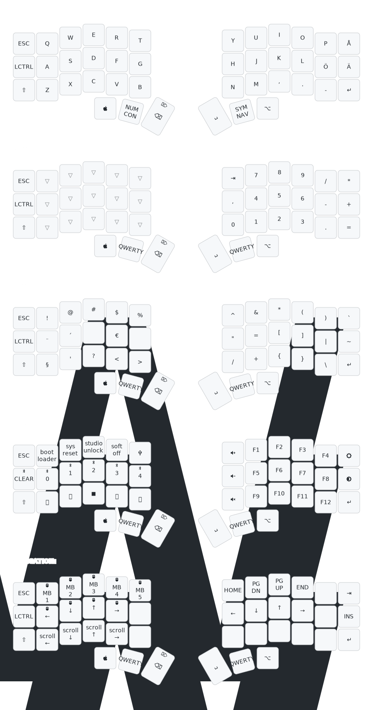

# My Corne-ish Zen Swedish MacOS keymap

A five layer keymap for the Corne-ish Zen keyboard to use on MacOS with
a Swedish layout.



## Five layers

- Qwerty - All letters in Swedish for Mac
- Number - Numpad on right side.
  Selected with one tap on middle thumb key on left side.
- Symbol - Symbol layer.
  Selected with one tap on middle thumb key on right side.
- Control - Left: Bluetooth controls, keyboard configuration, media controls. Right: Function keys
  Selected with two taps on middle thumb key on left side.
- Navigation - Left: Mouse controls Right: Keyboard movement
  Selected with two taps on middle thumb key on right side.

Tap middle thumb key on either side to go back from any layer to the QWERTY
layer.

### Qwerty layer

```
--------------------------------------------------------------------------------
|  ESC |  Q  |  W  |  E  |  R  |  T   |   |  Y  |  U   |  I  |  O  |  P  |  Å  |
| CTRL |  A  |  S  |  D  |  F  |  G   |   |  H  |  J   |  K  |  L  |  Ö  |  Ä  |
| SHFT |  Z  |  X  |  C  |  V  |  B   |   |  N  |  M   |  ,  |  .  |  -  | RET |
                   | GUI | LWR | BSPC |   | SPC | RSE  | ALT |
```

### Number layer

```
------------------------------------------------------------------------------
|  ESC |     |     |     |    |      |   | TAB |  7  |  8  |  9  |  /  |  *  |
| CTRL |     |     |     |    |      |   |  ,  |  4  |  5  |  6  |  -  |  +  |
| SHFT |     |     |     |    |      |   |  0  |  1  |  2  |  3  |  .  |  =  |
                   | GUI |    | BSPC |   | SPC |     | ALT |
```

### Symbol layer

```
-------------------------------------------------------------------------------
|  ESC |  !  |  @  |  #  |  $  |  %   |   |  ^  |  &  |  *  |  (  |  )  |  `  |
| CTRL |  ¨  |  ´  |     |  €  |      |   |  "  |  =  |  [  |  ]  | "|" |  ~  |
| SHFT |  §  |  '  |  ?  |  <  |  >   |   |  /  |  +  |  {  |  }  |  \  | RET |
                   | GUI |     | BSPC |   | SPC |     | ALT |
```

### Control layer

```
----------------------------------------------------------------------------------------
|  ESC | boot | reset | studio | off  | usb   |   | VOL+ | F1  | F2  | F3  | F4  | BR+ |
| BTCLR| BT1  | BT2   | BT3    | BT4  | BT5   |   | VOL- | F5  | F6  | F7  | F8  | BR- |
| SHFT | PREV | PLAY  | STOP   | NEXT | PSCRN |   | MUT  | F9  | F10 | F11 | F12 | RET |
                      | GUI    |      | BSPC  |   | ENT  |     | ALT |
```

### Navigation layer

```
---------------------------------------------------------------------------------------------------------
|  ESC | MB1       | MB2       | MB3     | MB4       | MB5  |   | HOME | PGDN | PGUP |  END  |    | TAB |
| BTCLR| MLEFT     | MDOWN     | MUP     | MRIGHT    |      |   | LEFT | DOWN |  UP  | RIGHT |    | INS |
| SHFT | SCRL_LEFT | SCRL_DOWN | SCRL_UP | SCRL_RIGHT|      |   |      |      |      |       |    | RET |
                               | GUI     |           | BSPC |   | ENT  |      | ALT  |
```

## Swedish keys

Swedish keys are made with the module [zmk-locales](https://github.com/joelspadin/zmk-locales).

The key code file `keys_sv_osx.h` was generated with
[zmk-locale-generator](https://github.com/joelspadin/zmk-locale-generator) using the following command:

```bash
zmk_locale_generator single SV config/sv-t-k0-osx-extended.xml --out config/keys_sv_osx.h
```

The [keyboard definition](https://github.com/unicode-org/cldr/blob/9122a1a738f02cfd652c4cc1c865e1fd789a92a2/keyboards/osx/sv-t-k0-osx-extended.xml)
file was downloaded from [Unicode CLDR Project](https://github.com/unicode-org/cldr).

## Keymap Drawer

The keymap image is generated with
(keymap drawer)[https://keymap-drawer.streamlit.app/],
a visualizer for keyboard keymaps using the config
[config/keymap-drawer.yaml](config/keymap-drawer.yaml)
